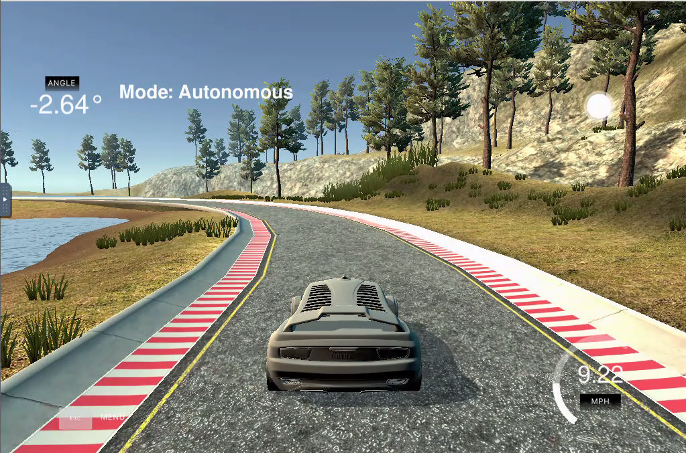
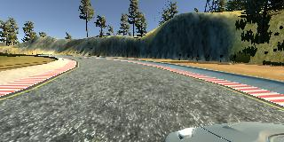
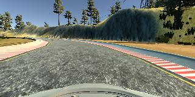
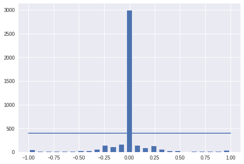
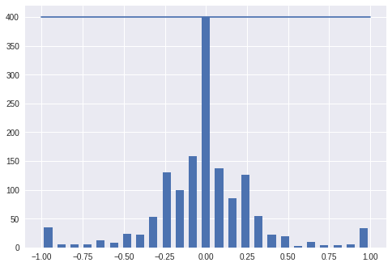
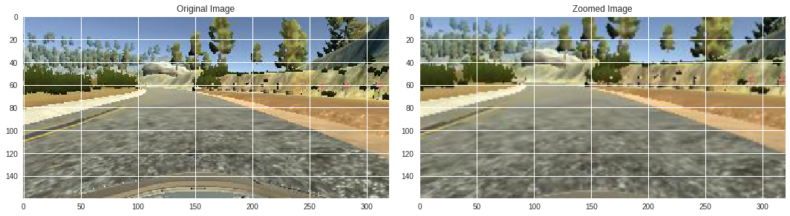
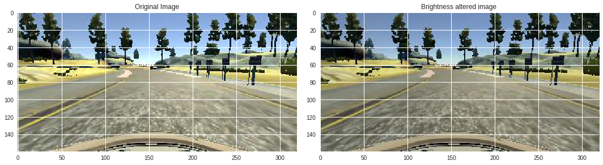
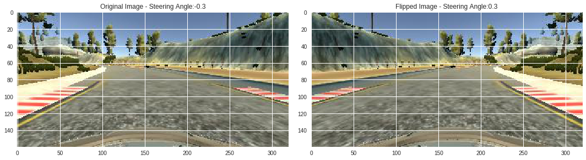
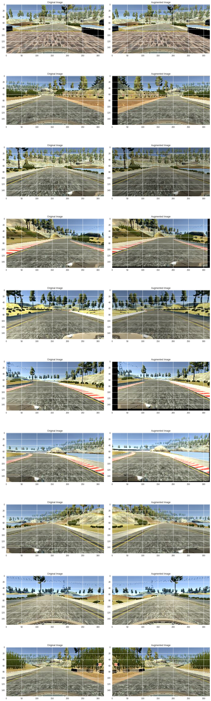
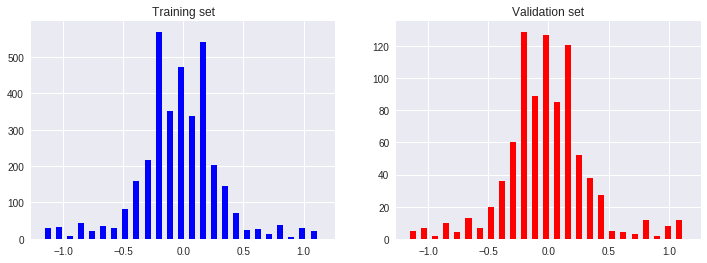

# Learning To Drive Using Behavioral Cloning
---



# Project Description
---

In this project, I use a neural network to clone car driving behavior. It is a supervised regression problem between the car steering angles and the road images in front of a car.

Those images were taken from three different camera angles (from the center, the left and the right of the car).

The network is based on [The NVIDIA model](https://devblogs.nvidia.com/parallelforall/deep-learning-self-driving-cars/) , which has been proven to work in this problem domain.

As image processing is involved, the model is using convolutional layers for automated feature engineering.

### Files included

- model.py The script used to create and train the model.
- drive.py The script to drive the car. You can feel free to resubmit the original drive.py or make modifications and submit your modified version.
- model.h5 The model weights.
- Video.mp4 - Video output of car driving in autonomous mode
- model.ipynb - Notebook file which I have used for data exploration and plotting.
- writeup_report.md - Writeup template
- Screenshots folder - It has screenshots png files that are referenced in writeup_report.md file

## Quick Start

### Install required python libraries and load data from github:
I have used `imgaug` for image augmentation as it flexible and support many
transformations in customized fashion.
* Open Linux terminal in workspace and install imgaug `pip install imgaug`
* I have my training data in git repo `https://github.com/PyarakaSrikanth/Data.git`
    * Open Linux terminal in workspace and pull data from git repository

    '''
    root@21ce5deb1f1f:/home/workspace# cd CarND-Behavioral-Cloning-P3/
root@21ce5deb1f1f:/home/workspace/CarND-Behavioral-Cloning-P3# git clone https://github.com/PyarakaSrikanth/Data.git
    '''
    * In Linux terminal

     '''
     root@21ce5deb1f1f:/home/workspace# cd CarND-Behavioral-Cloning-P3/
root@21ce5deb1f1f:/home/workspace/CarND-Behavioral-Cloning-P3# pip install imgaug

     '''

# Model Design
This section describes how the model was built.

## Data Collection

### Simulator settings
The simulator was run at the lowest possible graphics settings. This was done to keep the CPU load low but discussions in the forums suggested that it was a good strategy to train on low resolution images.

### Data collection strategy
To collect human driving data, the simulator was run in training mode. The car was driven around the track using a keyboard for about 1-2 laps and driving data recorded. Then the direction was reversed and another 1-2 laps were recorded. In addition a few short recordings were made of tricky parts of the track. The data recorded in the reverse direction ensured that the model did not simply memorize the conditions of the forward lap and generalized well to test-time conditions. Some sharps turn were tricky and initial models would swerve wildly when negotiating them. The additional recordings helped the model stay in the middle of the road.

The simulator recorded screenshots taken from the perspective of 3 cameras mounted a the from of the car at the left, center and a right of the hood. Along with these images the simulator also recorded the driving parameters at the instant an image was captured. These included steering angle, throttle and speed and were written to **driving_log.csv**. The images below show the same potion of the track from the left, center and right camera's perspective, respectively.

* **left**


* **center**


* **right**


# Loading data
I have my training data in git repo `https://github.com/PyarakaSrikanth/Data.git`
   * Open Linux terminal in workspace and pull data from git repository

   '''
   root@21ce5deb1f1f:/home/workspace# cd CarND-Behavioral-Cloning-P3/
root@21ce5deb1f1f:/home/workspace/CarND-Behavioral-Cloning-P3# git clone https://github.com/PyarakaSrikanth/Data.git
   '''
   * Folder structure
   '''

   -rw-r--r-- 1 root root 881732 Dec 31 06:36 driving_log_1.csv

   -rw-r--r-- 1 root root 484538 Dec 31 07:45 driving_log.csv

   drwxr-xr-x 2 root root 786432 Dec 31 14:30 IMG
   '''

# Cleaning data:

Training data had a hugely disproportionate instances of driving straight considering steering angle with value '0'.
Best strategy is to drop data points above threshold from histogram plot to equalized logs.
* Data points divided into 25 bins and blue line is threshold set to equalize log. Which is around 400



* Data points above threshold 400 removed . Modified histogram plotting



## Data Preprocessing:

- Images are cropped so that the model won’t be trained with the sky and the car front parts
- the images are resized to 66x200 (3 YUV channels) as per NVIDIA model
- GaussianBlur - to Blur image to smoothing image and remove noise
- the images are normalized

```
def img_preprocess(img):
    img = img[60:135,:,:]
    img = cv2.cvtColor(img, cv2.COLOR_RGB2YUV)
    img = cv2.GaussianBlur(img,  (3, 3), 0)
    img = cv2.resize(img, (200, 66))
    img = img/255
    return img
```

  

## Data Argumentation:

### Image Augmentation

For training, I used the following augmentation technique along with Python generator to generate unlimited number of images:

** Library used imgaug **
`pip install imgaug`


- Zooming will allow our model for better feature extraction
    *  `zoom(image)`
        
- Panning - Image pan is vertical and horizontal translation of images
translate percentage set 10% left and right as well 10% up and down
    *  `pan(image)`
       
- Randomly altering image brightness (lighter or darker)
   *  `img_random_brightness(image)`    
       
- Flip steering angle for left to positive and right to negative,
It would be useful to create balanced distribution of left and right angles
steering angle
    * `img_random_flip(image, steering_angle)`
       

- `random_augment(image,steering_angle)` It is found that combined augmentation with variety of data will help model better generalize
Code each augment will only be applied 50% on new image
    - Randomly choose right, left or center images.
    - Randomly choose zoomed image 50%
    - Randomly flip image left/right 50%
    - Randomly altered brightness image 50%
    - Randomly translate image vertically 50%



- Batch generator function will take input data , create defined number of augmented images with label
- Benefit It generate augmented images on fly avoid bottleneck memory space issue.
`batch_generator(image_paths, steering_ang, batch_size, istraining)`

## Model Architecture Design

The design of the network is based on [the NVIDIA model](https://devblogs.nvidia.com/parallelforall/deep-learning-self-driving-cars/), which has been used by NVIDIA for the end-to-end self driving test.  As such, it is well suited for the project.  

It is a deep convolution network which works well with supervised image classification / regression problems.  As the NVIDIA model is well documented, I was able to focus how to adjust the training images to produce the best result with some adjustments to the model to avoid overfitting and adding non-linearity to improve the prediction.

I've added the following adjustments to the model.

- I've also included ELU for activation function for every layer except for the output layer to introduce non-linearity.

In the end, the model looks like as follows:

- Convolution: 5x5, filter: 24, strides: 2x2, activation: ELU
- Convolution: 5x5, filter: 36, strides: 2x2, activation: ELU
- Convolution: 5x5, filter: 48, strides: 2x2, activation: ELU
- Convolution: 3x3, filter: 64, strides: 1x1, activation: ELU
- Convolution: 3x3, filter: 64, strides: 1x1, activation: ELU
- Fully connected: neurons: 100, activation: ELU
- Fully connected: neurons:  50, activation: ELU
- Fully connected: neurons:  10, activation: ELU
- Fully connected: neurons:   1 (output)

As per the NVIDIA model, the convolution layers are meant to handle feature engineering and the fully connected layer for predicting the steering angle.  However, as stated in the NVIDIA document, it is not clear where to draw such a clear distinction.  Overall, the model is very functional to clone the given steering behavior.  

The below is an model structure output from the Keras which gives more details on the shapes and the number of parameters.

| Layer (type)                   |Output Shape      |Params  |Connected to     |
|--------------------------------|------------------|-------:|-----------------|
|convolution2d_1 (Convolution2D) |(None, 31, 98, 24)|1824    |convolution2d_1  |
|convolution2d_2 (Convolution2D) |(None, 14, 47, 36)|21636   |convolution2d_2  |
|convolution2d_3 (Convolution2D) |(None, 5, 22, 48) |43248   |convolution2d_3  |
|convolution2d_4 (Convolution2D) |(None, 3, 20, 64) |27712   |convolution2d_4  |
|convolution2d_5 (Convolution2D) |(None, 1, 18, 64) |36928   |convolution2d_5  |
|flatten_1 (Flatten)             |(None, 1152)      |0       |convolution2d_5  |
|dense_1 (Dense)                 |(None, 100)       |115300  |flatten_1        |
|dense_2 (Dense)                 |(None, 50)        |5050    |dense_1          |
|dense_3 (Dense)                 |(None, 10)        |510     |dense_2          |
|dense_4 (Dense)                 |(None, 1)         |11      |dense_3          |
|                                |**Total params**  |252219  |                 |


### Training and training

## Training, Validation and Test

I splitted the images into train and validation set in order to measure the performance at every epoch.  Testing was done using the simulator.

Training and validation set are balanced.


As for training,

- I used mean squared error for the loss function to measure how close the model predicts to the given steering angle for each image.
- I used Adam optimizer for optimization with learning rate of 1.0e-3.
- epoch 10
- steps_per_epoch=300
- validation_steps=200
- batch size 100
- Keras' `fit_generator` method is used to train images generated by the generator

### Model results:
'''

Epoch 1/10
300/300 [==============================] - 221s - loss: 0.1217 - val_loss: 0.1210

Epoch 2/10
300/300 [==============================] - 212s - loss: 0.0782 - val_loss: 0.0656

Epoch 3/10
300/300 [==============================] - 213s - loss: 0.0649 - val_loss: 0.0492

Epoch 4/10
300/300 [==============================] - 213s - loss: 0.0512 - val_loss: 0.0366

Epoch 5/10
300/300 [==============================] - 213s - loss: 0.0463 - val_loss: 0.0391

Epoch 6/10
300/300 [==============================] - 213s - loss: 0.0441 - val_loss: 0.0338

Epoch 7/10
300/300 [==============================] - 213s - loss: 0.0440 - val_loss: 0.0354

Epoch 8/10
300/300 [==============================] - 213s - loss: 0.0386 - val_loss: 0.0313

Epoch 9/10
300/300 [==============================] - 214s - loss: 0.0389 - val_loss: 0.0307

Epoch 10/10
300/300 [==============================] - 213s - loss: 0.0367 - val_loss: 0.0290

'''

**Val_loss 0.0290 which is less than training loss 0.0367**

Car able to drive in autonomous mode video is in workspace `video.mp4`

## To do:
* My model is not doing well on challenge video , Need to tune my model or collect data to get work on optional video.
* I will have to try different models apart from Nvidia model architecture.
